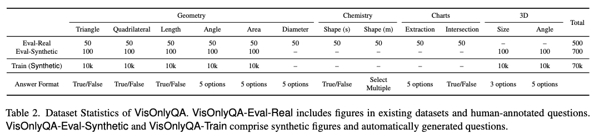

# VisOnlyQA

This repository contains the code and data for the paper "VisOnlyQA: Large Vision Language Models Still Struggle with Visual Perception of Geometric Information".

VisOnlyQA is designed to evaluate the visual perception capability of large vision language models (LVLMs) on geometric information of scientific figures. The evaluation set includes 1,200 mlutiple choice questions in 12 visual perception tasks on 4 categories of scientific figures. We also provide a training dataset consisting of 70k instances.

* Datasets:
  * Eval-Real: [https://huggingface.co/datasets/ryokamoi/VisOnlyQA_Eval_Real](https://huggingface.co/datasets/ryokamoi/VisOnlyQA_Eval_Real)
  * Eval-Synthetic: [https://huggingface.co/datasets/ryokamoi/VisOnlyQA_Eval_Synthetic](https://huggingface.co/datasets/ryokamoi/VisOnlyQA_Eval_Synthetic)
  * Train: [https://huggingface.co/datasets/ryokamoi/VisOnlyQA_Train](https://huggingface.co/datasets/ryokamoi/VisOnlyQA_Train)
* Code: [https://github.com/psunlpgroup/VisOnlyQA](https://github.com/psunlpgroup/VisOnlyQA)

<p align="center">

</p>

```bibtex
@misc{kamoi2024visonlyqa,
    title={VisOnlyQA: Large Vision Language Models Still Struggle with Visual Perception of Geometric Information}, 
    author={Ryo Kamoi and Yusen Zhang and Sarkar Snigdha Sarathi Das and Ranran Haoran Zhang and Rui Zhang},
    year={2024},
}
```

## Dataset

The dataset is provided in Hugging Face Dataset.

* Eval-Real: [https://huggingface.co/datasets/ryokamoi/VisOnlyQA_Eval_Real](https://huggingface.co/datasets/ryokamoi/VisOnlyQA_Eval_Real)
  * 500 instances for questions on figures in existing datasets (e.g., MathVista, MMMU, and CharXiv)
* Eval-Synthetic: [https://huggingface.co/datasets/ryokamoi/VisOnlyQA_Eval_Synthetic](https://huggingface.co/datasets/ryokamoi/VisOnlyQA_Eval_Synthetic)
  * 700 instances for questions on synthetic figures
* Train: [https://huggingface.co/datasets/ryokamoi/VisOnlyQA_Train](https://huggingface.co/datasets/ryokamoi/VisOnlyQA_Train)
  * 70,000 instances for training (synthetic figures)

[dataset](https://github.com/psunlpgroup/VisOnlyQA/tree/main/dataset) folder of the GitHub repository includes identical datasets, except for the training data.

### Examples

<p align="center">

</p>

### Usage

```python
from datasets import load_dataset

real_eval = load_dataset("ryokamoi/VisOnlyQA_Eval_Real")
real_synthetic = load_dataset("ryokamoi/VisOnlyQA_Eval_Synthetic")

# Splits
print(real_eval.keys())
# dict_keys(['geometry__triangle', 'geometry__quadrilateral', 'geometry__length', 'geometry__angle', 'geometry__area', 'geometry__diameter_radius', 'chemistry__shape_single', 'chemistry__shape_multi', 'charts__extraction', 'charts__intersection'])

print(real_synthetic.keys())
# dict_keys(['syntheticgeometry__triangle', 'syntheticgeometry__quadrilateral', 'syntheticgeometry__length', 'syntheticgeometry__angle', 'syntheticgeometry__area', '3d__size', '3d__angle'])

# Prompt
print(real_eval['geometry__triangle'][0]['prompt_no_reasoning'])
# There is no triangle ADP in the figure. True or False?

# A triangle is a polygon with three edges and three vertices, which are explicitly connected in the figure.

# Your response should only include the final answer (True, False). Do not include any reasoning or explanation in your response.

# Image
print(real_eval['geometry__triangle'][0]['decoded_image'])
# <PIL.JpegImagePlugin.JpegImageFile image mode=RGB size=103x165 at 0x7FB4F83236A0>

# Answer
print(real_eval['geometry__triangle'][0]['answer'])
# False
```

### Data Format

Each instance of VisOnlyQA dataset has the following attributes:

#### Features
* `decoded_image`: [PIL.Image] Input image
* `question`: [string] Question (without instruction)
* `prompt_reasoning`: [string] Prompt with intstruction to use chain-of-thought
* `prompt_no_reasoning`: [string] Prompt with intstruction **not** to use chain-of-thought
* `answer`: [string] Correct answer (e.g., `True`, `a`)

#### Metadata
* `image_path`: [string] Path to the image file
* `image_category`: [string] Category of the image (e.g., `geometry`, `chemistry`)
* `question_type`: [string] `single_answer` or `multiple answers`
* `task_category`: [string] Category of the task (e.g., `triangle`)
* `response_options`: [List[string]] Multiple choice options (e.g., `['True', 'False']`, `['a', 'b', 'c', 'd', 'e']`)
* `source`: [string] Source dataset
* `id`: [string] Unique ID

### Statistics

<p align="center">

</p>

## Directory Structure

Core directories and files of this repository:

```
.
├── dataset  # VisOnlyQA dataset (Eval-Real, Eval-Synthetic)
├── results
│   ├── model_resposnes  # Responses from LVLMs on VisOnlyQA
│   ├── evaluation_metrics  # Accuracy
│   ├── tables  # Tables in the paper
│   ├── figures  # Figures in the paper
│   └── analysis  # Analysis of the results
├── setup
│   └── setup.sh  # Run this script to setup the environment
├── shell  # Shell scripts for reproducing our experiments
├── src  # Source code
├── config  # Main config file is in src/config.py
└── finetuning_results  # Log files of the fine-tuning experiments
```

## Setup

```bash
bash setup.sh
```

We run our experiments on the following environment. You might need to modify configulations if you run our code on a different environment.

* Eight NVIDIA A100 SXM4 80GB GPUs 
* Driver Version: 550.54.15
* CUDA Version: 12.4

## Evaluate LVLMs on VisOnlyQA

Please refer to the shell scripts in the [shell/4_evaluation](shell/4_evaluation) folder.

```bash
# for small open LVLMs
bash shell/4_evaluation/evaluation_open_small.sh
```

## Reproduce Fine-tuning

We fine-tuned the following LVLMs on VisOnlyQA-Train.

* [InternVL2 (4B, 8B)](https://internvl.github.io/blog/2024-07-02-InternVL-2.0/)
* [Qwen2-VL (2B, 7B)](https://qwenlm.github.io/blog/qwen2-vl/)
* [Phi-3.5-Vision](https://huggingface.co/microsoft/Phi-3.5-vision-instruct)

Our fine-tuning code is based on the code provided by the authors of the models. Please refer to the shell scripts in the [shell/3_training](shell/3_training) folder for details.

```bash
bash shell/3_training/train_internvl2_4B.sh
```

## Reproduce Dataset Creation

Datasets are provided in the [dataset](dataset) folder and at Hugging Face Datasets. You do **not** need to run the dataset creation code to use the datasets.

If you are interested in reproducing the dataset creation process, follow the instructions below.

### Setup

If you are interested in reproducing the annotation interface: We use Google Spreadsheet for annotation. You need to set up Google API Credentials.

* Follow the instructions at [https://pythonhosted.org/PyDrive/quickstart.html#authentication](https://pythonhosted.org/PyDrive/quickstart.html#authentication).
* Follow the instructions at [https://docs.gspread.org/en/latest/oauth2.html](https://docs.gspread.org/en/latest/oauth2.html).
  * Download the credential file at [credentials/google_spreadsheet_credential.json](credentials/google_spreadsheet_credential.json).
  * Put your Google Account (email address)  in [credentials/google_sccount_email.txt](credentials/google_sccount_email.txt).

```bash
conda activate visonlyqa
export HF_ACCOUNT="your_hugging_face_account"  # dataset will be created in your HF account as private datasets
export CONDA_SH="~/anaconda3/etc/profile.d/conda.sh"  # set your anaconda path
```

### Run

Refer to the shell files in [shell/1_train_dataset_creation](shell/1_train_dataset_creation) and [shell/2_evaluation_dataset_creation](shell/2_evaluation_dataset_creation).

## License

Please refer to [LICENSE.md](./LICENSE.md).

## Contact

If you have any questions, feel free to open an issue or reach out directly to [Ryo Kamoi](https://ryokamoi.github.io/) (ryokamoi@psu.edu).
